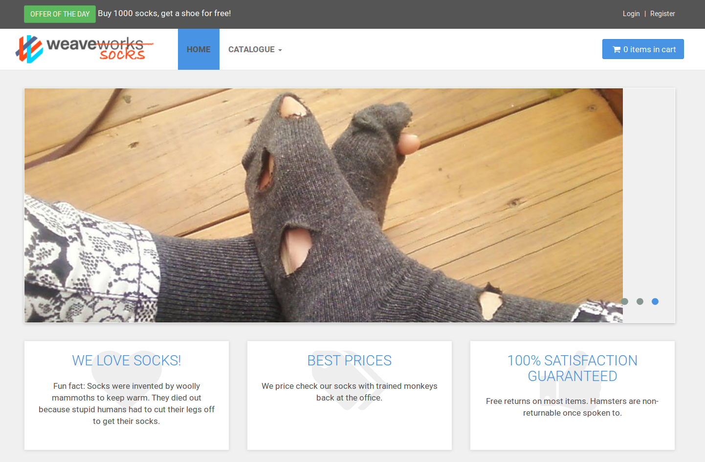

# SockShop

> **SockShop** is a microservices demo application that simulates an e-commerce website that sells socks.

`Sockshop` is intended to aid the demonstration and testing of microservice and cloud native technologies.

  - [SockeShop site](https://microservices-demo.github.io/)
  - [Github repo](https://github.com/microservices-demo)

### SockShop Architecture
`Sockshop` is composed by nine microservices (plus the `edge-router` between the _User_ and the _Front End_).
The figure below shows the microservices composing the architecture.

<div style="text-align:center">
  
</div>


Each microservice is in charge to control a single functionality of the application:
- `Front End`: is the front end of the application.
- `Order`: manages the orders.
- `Payment`: manages the payments.
- `User`: manages the list of the users and their information.
- `Catalogue`: manages the  socks stored in the catalogue.
- `Cart`: manages the cart of an user.
- `Shipping`: manages the shipping procedure of an order.
- `Queue`: enqueues the orders in a queue.
- `Queue Master`: processes the orders queue. It spawns new docker containers (`weaveworksdemos/worker`) that simulate the shipping process.


Main characteristic of the `SockShop` application:
 - _Microservice-based application_: it is designed to have as much as possible microservices  communicate using REST over HTTP.
 - _Polyglot_: it exploits different technologies and programming languages (_Java_, _go_,_NodeJs_, _RabbitMq_)
 - _Deployemnt_: it is used to demostrate the deployemnt on different technologies (e.g. `Docker Swarm`, `Docker Compose`,` 	kubernetes`, `Mesos`, `aws-ecs`, etc )
 - _Testing_: it is equipped with a load testing ([`Locust.io`](https://locust.io/)), a  tracing tool ([`Zipkin`](http://zipkin.io/))

## Run sockshop application with `tosKer`
The guide assume that `tosKer` is installed locally (`pip install tosker`).

1. Build the `jar` files for the `Order`, `Cart`, `Shipping` microservice.
```
cd  TosKer/data/examples/sockshop
./build-jars.sh
```
2. Create and start all the component with `TosKer`
 ```
 tosker sockshop.yml create start
 ```

3. Check if all the components are running:
 ```
 tosker sockshop.yml ls
 ```

4. Access the `http://localhost` in order view the `sockshop` web-based interface.

<div style="text-align:center">
  
</div>


 ## Sockshop testing
In order to test the `Sockshop` application, the `locust.io` tool can be exploited.

`Locust` is a load testing tool that runs a certain amount of users that generate traffic to the application and test if the application is resilient to the load.

 #### Using locust

 `git clone https://github.com/microservices-demo/load-test.git`

 `cd \load-test`

 `pip install locustio`

 Load-test with locust.py (and web interface):

 `locust --host=http://127.0.0.1 -f  locustfile.py `

 Got to `http://127.0.0.1:8089/` insert the number of users and the hatch rate(The rate per second in which clients are spawned.).


 Load-test  with locust script:
 ```Usage:
   runLocust.sh [ http://hostname/ ] OPTIONS

 Options:
   -d  Delay before starting
   -h  Target host url, e.g. http://localhost/
   -c  Number of clients (default 2)
   -r  Number of requests (default 10)

 Description:
   Runs a Locust load simulation against specified host.
 ```

 `./runLocust.sh  -d 60 -r 200 -c 2 -h edge-router" `


 Load-test on Docker with Locust

 `docker build -t load-test .`

 `docker run --network dockercompose_default  load-test -h edge-router -c 2 -r 200 `


 ####  Zipkin

Zipkin traces the communication of the services.

The Zipkin web page is available on the endpoint: 'http://127.0.0.1:9411'


<!-- ## front-end

`front-end` default [endpoints](https://github.com/microservices-demo/front-end/blob/master/api/endpoints.js)

```
module.exports = {
    catalogueUrl:  util.format("http://catalogue%s", domain),
    tagsUrl:       util.format("http://catalogue%s/tags", domain),
    cartsUrl:      util.format("http://carts%s/carts", domain),
    ordersUrl:     util.format("http://orders%s", domain),
    customersUrl:  util.format("http://user%s/customers", domain),
    addressUrl:    util.format("http://user%s/addresses", domain),
    cardsUrl:      util.format("http://user%s/cards", domain),
    loginUrl:      util.format("http://user%s/login", domain),
    registerUrl:   util.format("http://user%s/register", domain),
};
```


## user

``` $ /user -h
Usage of /user:
  -database string
    	Database to use, Mongodb or ... (default "mongodb")
  -link-domain string
    	HATEAOS link domain (default "user")
  -mongo-host string
    	Mongo host (default "user-db")
  -mongo-password string
    	Mongo password
  -mongo-user string
    	Mongo user
  -port string
    	Port on which to run (default "8084")
  -zipkin string
    	Zipkin address
```

## orders

`java.sh` script launched inside the `weaveworksdemos/msd-java:8u131` for running the `orders` Software.

``` /usr/local/bin # cat java.sh
#!/bin/sh

if [ -z "$JAVA_OPTS" ]; then
  JAVA_OPTS="-XX:+UnlockExperimentalVMOptions -XX:+UseCGroupMemoryLimitForHeap -XX:MaxRAMFraction=1 -XX:UseG1GC"
fi
```

API.
- GET http://0.0.0.0:8082/health : return a json

## payment

`Payments`  microservice help.

```root@a76dbadda182:/go/src/github.com/microservices-demo/payment# /app/main -h
    Usage of /app/main:
      -decline float
        	Decline payments over certain amount (default 100)
      -port string
        	Port to bind HTTP listener (default "8080")
      -zipkin string
        	Zipkin address -->
```
